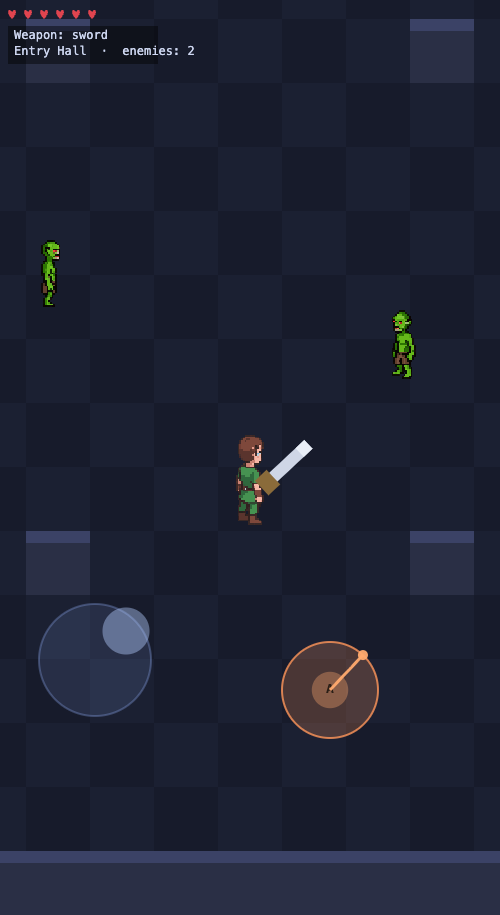

# Floating-Thumb Dungeon

A mobile-first, top-down dungeon crawler built as a **capability demo for a touch control scheme** that fixes the classic problem of fixed on-screen buttons losing contact when your thumb drifts off them.

**▶ Live demo: https://dolan.github.io/floating-thumb-dungeon/** (open on a phone, portrait)

<p align="center">
  
</p>

Vanilla HTML5 Canvas + ES modules. No build step, no dependencies.

---

## The mechanic (the whole point)

On a touchscreen there are no physical buttons to feel for, so a thumb that drifts a few millimetres slides off a fixed button and the input dies. The fix here is simple: **controls are anchored to the touch point, not to screen coordinates.** Wherever your thumb lands *becomes* the control's origin, and input is measured relative to that origin — so drift is impossible by construction.

### Left half — floating joystick
- Touch anywhere on the left → that point becomes the joystick's center.
- Movement = the offset of your thumb from that origin, clamped to `maxRadius`, with a `deadzone` to ignore jitter. Magnitude is analog (walk ↔ run).
- The base ring is always drawn under your thumb, so it can never be "missed."

### Right half — action rocker (a small state machine)
Touching the right half arms the rocker at your contact point. What happens next is resolved by *how* your thumb moves relative to that origin:

- **Tap** — release quickly (within `TAP_MS`) without moving past `B_THRESHOLD` → fires **A**: *use* the equipped weapon (sword swing, gun shot, rock/fist punch).
- **Push** — slide past `B_THRESHOLD` in any direction → commits **B**: *throw* the equipped item, aimed along the direction you pushed. A live aim line shows while you're pushing.

Because the contact is continuous, the gesture reads as "press A, then push to commit B" — one thumb, two actions, zero buttons to miss.

All of this lives in [`src/input.js`](src/input.js); the game is just a wrapper to make the controls worth using.

---

## Play

It's a static site — any static server works (ES modules require `http://`, not `file://`):

```bash
python3 -m http.server 8000
# open http://localhost:8000   (or the machine's LAN IP from a phone)
```

**Goal:** clear three connected rooms (Entry Hall → Guard Room → Treasury). Walk over a weapon to equip it — sword (swing), gun (shoot), rock (throw); bare fists punch. Thrown weapons fly, deal damage, and land as retrievable pickups. Defeat every enemy to win.

**Desktop controls** (for development): arrow keys / WASD to move, **Z** = A (use), **X** = B (throw).

---

## Tuning the feel

The rocker's feel is the thing most worth adjusting on a real device. All knobs are centralized at the top of [`src/input.js`](src/input.js):

```js
export const TUNABLES = {
  TAP_MS: 180,      // max press duration that still counts as a tap (A)
  B_THRESHOLD: 26,  // displacement (CSS px) past which the rocker commits to B (throw)
  maxRadius: 56,    // joystick clamp radius (CSS px) — thumb travel for full speed
  deadzone: 10,     // joystick deadzone (CSS px) — ignored jitter near the origin
};
```

| Knob | Lower it → | Raise it → |
|------|-----------|-----------|
| **`TAP_MS`** | stricter taps (must flick fast); fewer accidental A's | forgiving taps, but A feels laggier and overlaps B |
| **`B_THRESHOLD`** | twitchy throws, easy to fire B by accident | B requires a deliberate shove; almost no accidental throws |
| **`maxRadius`** | very sensitive stick, small thumb travel | gentler stick, needs a big reach for full-speed run |
| **`deadzone`** | reacts to the tiniest motion (can feel jittery) | rock-steady when still, but ignores small nudges |

**Design variation — when does B fire?** The default commits B *the instant* the thumb crosses `B_THRESHOLD` (snappy, great for twin-stick-style throwing). The plan's alternative is to commit B *on release* instead — letting the player wind up and re-aim before letting go. To switch, move the `pendingB = unitAim(...)` line out of the threshold-crossing branch in `updateRocker()` and into the `ARMED`-release branch in `onTouchEnd()` of `src/input.js`. Try both on-device; "fire on cross" feels more arcade, "fire on release" more deliberate.

---

## Modifying the game

Everything is small, dependency-free ES modules — edit and refresh.

- **New / retuned weapon** — add an entry to `WEAPONS` in [`src/weapons.js`](src/weapons.js) (`reach`, `arc`, `dmg`, `cd`, or `bulletSpeed` for ranged) and a case in `drawHeldWeapon()`.
- **New / retuned enemy** — add an entry to `DEFS` in [`src/enemy.js`](src/enemy.js) (`hp`, `speed`, `sight`, `range`, `dmg`, `atkCd`, `sprite`) and place it in `spawnRoomContents()`.
- **New room / layout** — edit `buildRooms()` in [`src/world.js`](src/world.js): `makeRoom(name, w, h, { pillars, doors })`. Doors link by `{ x, y, dir, to, toDoor }`.
- **New sprite** — drop PNG(s) in `assets/sprites/` and register them in `assets/sprites/manifest.json` (`actors` take 8 per-direction files keyed `S,SE,E,…`; `objects` take one file). Missing entries fall back to a procedural placeholder, so the game never hard-breaks on a missing asset.
- **New sound** — drop an `.ogg` in `assets/audio/sfx/`, add it to the `SFX` map in [`src/audio.js`](src/audio.js), and call `sfx.play('yourName')` from the relevant event.

### Project layout

```
index.html            viewport meta, canvas, boot overlay
src/input.js          floating joystick + action-rocker state machine (the centerpiece)
src/main.js           entry, fixed-timestep loop, subsystem wiring
src/player.js         movement, 8-dir facing, equip, attack timing
src/weapons.js        fists/sword/gun/rock, projectiles, throw→pickup
src/enemy.js          rule-based AI + per-room spawning
src/room.js           tilemap + AABB-vs-grid collision + doors
src/world.js          room graph, transitions, win condition
src/render.js         camera, tilemap, sprite blit, HUD, control overlays
src/sprites.js        loads pixel-art PNGs via assets/sprites/manifest.json
src/audio.js          WebAudio SFX engine (gesture-unlocked for mobile)
assets/sprites/       per-direction character PNGs + weapon objects + manifest
assets/audio/sfx/     curated sound effects
docs/gameplay.png     the screenshot above
```

---

## Credits & licensing

- **Code:** MIT © 2026 Dave Dolan — see [LICENSE](LICENSE).
- **Sprites:** generated by the author with [PixelLab](https://pixellab.ai); owned by the author and distributed under the MIT terms above.
- **Sound effects:** by [Kenney](https://kenney.nl) — *RPG Audio* and *Impact Sounds* packs, licensed **CC0 1.0** (public domain). See [assets/audio/CREDITS.txt](assets/audio/CREDITS.txt). Thanks, Kenney! 🙏
